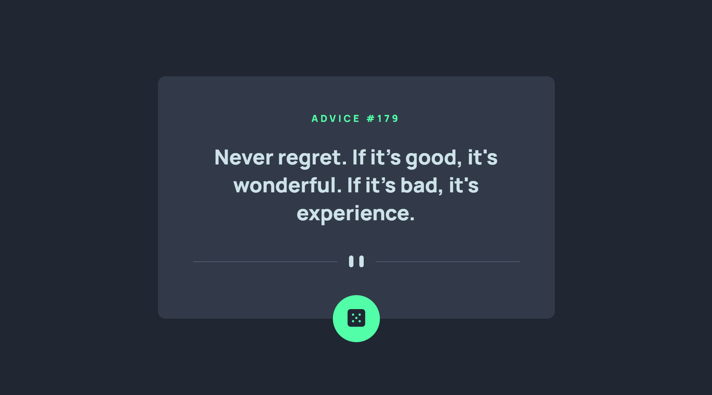

# Frontend Mentor - Advice generator app solution

This is a solution to the [Advice generator app challenge on Frontend Mentor](https://www.frontendmentor.io/challenges/advice-generator-app-QdUG-13db). Frontend Mentor challenges help you improve your coding skills by building realistic projects.

## Table of contents

-   [Overview](#overview)
    -   [The challenge](#the-challenge)
    -   [Screenshot](#screenshot)
    -   [Links](#links)
-   [My process](#my-process)
    -   [Built with](#built-with)
    -   [What I learned](#what-i-learned)
    -   [Continued development](#continued-development)
    -   [Useful resources](#useful-resources)
-   [Author](#author)

## Overview

### The challenge

Users should be able to:

-   View the optimal layout based on the device's screen size
-   See hover states for the interactive elements
-   Generate a new random quote by clicking the dice icon

### Screenshot

### Links

-   Solution URL: [Add solution URL here](https://github.com/Andro87/advice-generator-app.git)
-   Live Site URL: [Add live site URL here](https://your-live-site-url.com)

## My process

### Built with

-   Semantic HTML5 markup
-   Sass
-   Flexbox
-   Mobile-first workflow
-   [React](https://reactjs.org/) - JS library
-   [Next.js](https://nextjs.org/) - React framework

### What I learned

This project helped me practice interacting with 3rd-party APIs.
It has allowed me to improve my skills and learn more about how to use APIs with React.

### Continued development

I will continue improving my knowledge about how to use APIs and the best way to interact with them.

### Useful resources

-   [Scrimba](www.scrimba.com) - The Scrimba course _Learn React for free with Bob Ziroll_ has been a great resource to improve my knowledge about both React and interactions with APIs.

## Author

-   Frontend Mentor - [@Andro87](https://www.frontendmentor.io/profile/Andro87)
